# Accord — Architecture Diagrams

---

## 1. System Architecture Overview

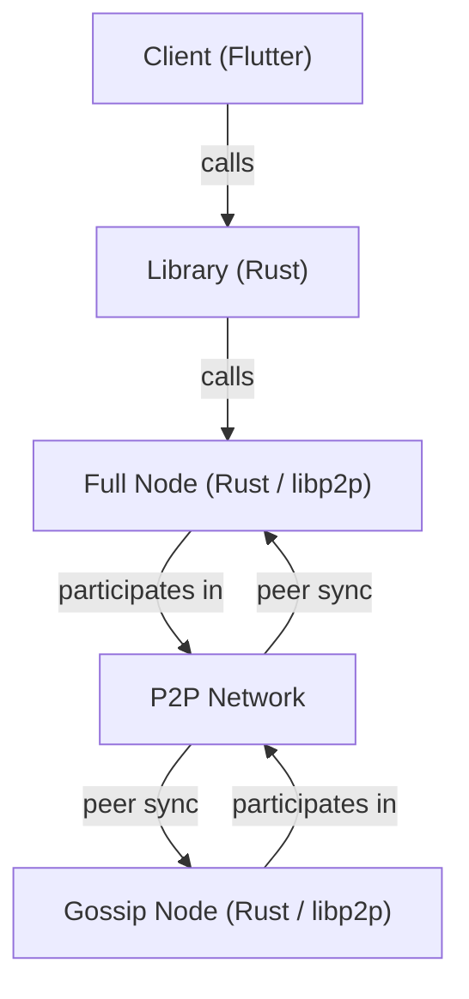

---

## 2. Peer Discovery

Both Full and Gossip nodes use the same two-pronged discovery strategy.

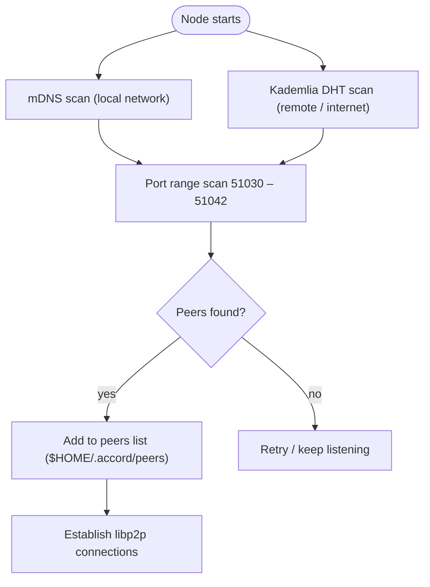

---

## 3. Full Node — Storage Layout

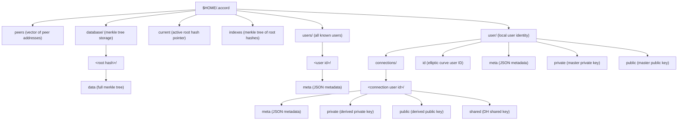

---

## 4. Cryptographic Key Hierarchy

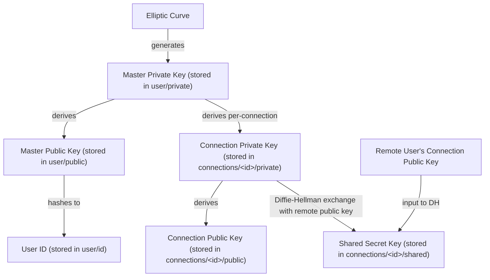

---

## 5. Sync Workflows

### 5a. Outbound Sync — Node Initiates

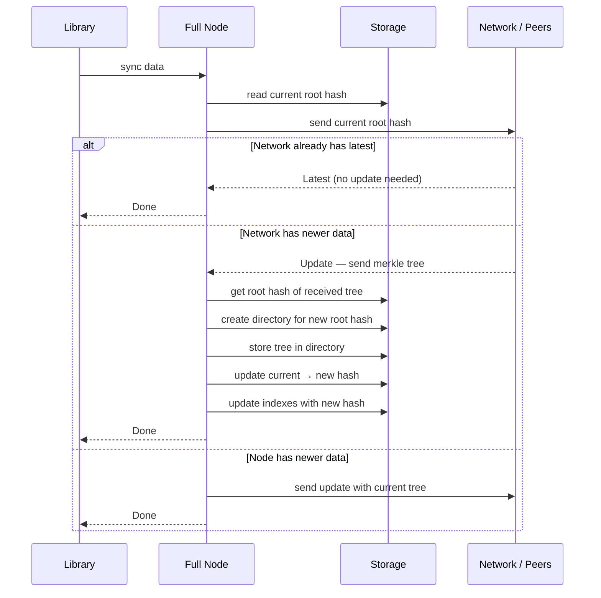

### 5b. Inbound Sync — Peer Initiates

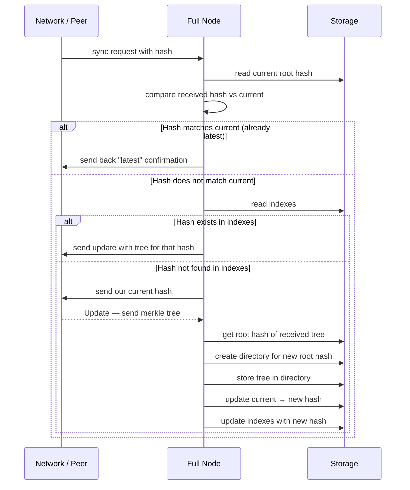

---

## 6. Message Workflow

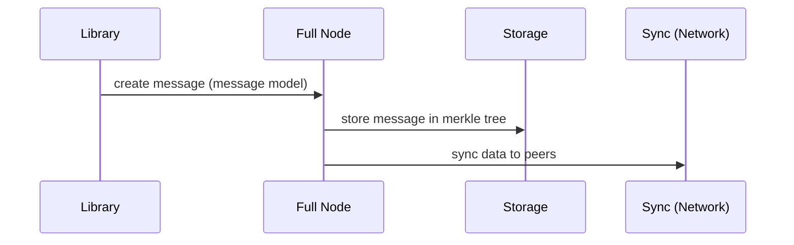

---

## 7. User Workflows

### 7a. Create User

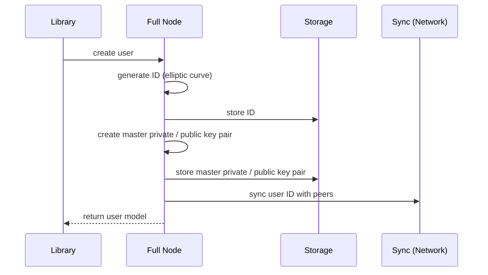

### 7b. Get All Users

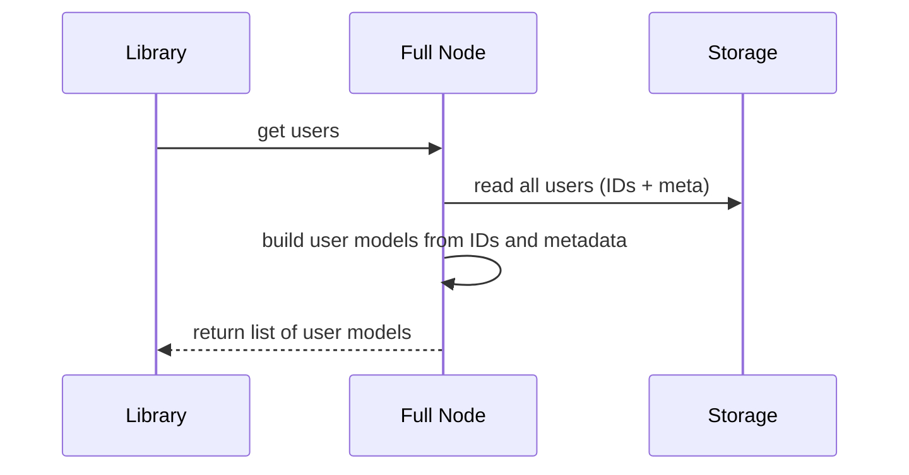

### 7c. Get Single User

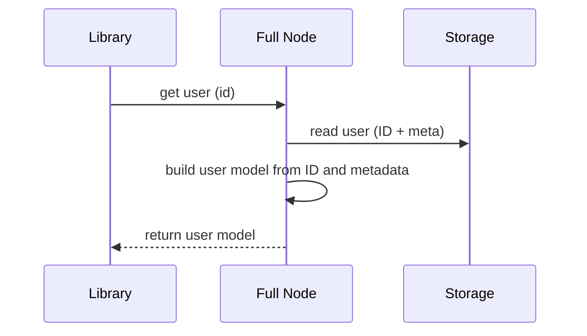

---

## 8. Connection Workflow (DH Key Exchange)

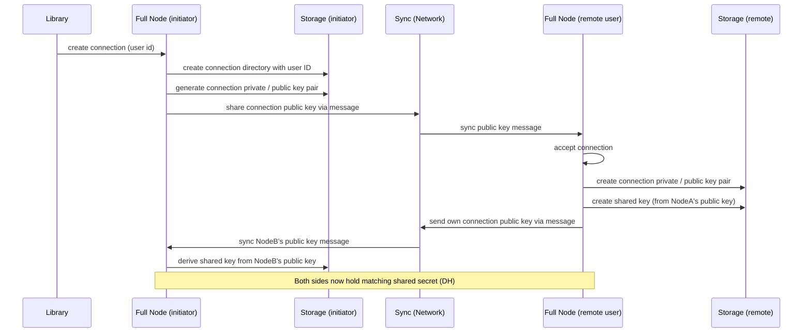
