# Accord — Planning

> A plugin-driven, p2p, Discord-like alternative.

---

## Contents

| File / Folder | Description |
|---|---|
| [`PLAN.md`](./PLAN.md) | Full written specification — architecture, workflows, and data models |
| [`DIAGRAMS.md`](./DIAGRAMS.md) | Mermaid source for all architecture diagrams |
| [`diagrams/`](./diagrams/) | Exported PNG images and `.mmd` source files |

---

## Architecture Overview

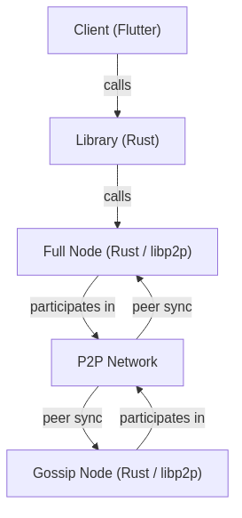

Accord is composed of three layers:

- **P2P Nodes** (Rust + libp2p) — handle peer discovery, data storage, and sync
- **Library** (Rust) — exposes a typed API over the node; handles encryption and plugins
- **Clients** (Flutter) — consume the library to provide user interfaces

---

## P2P Nodes

Nodes run in one of two modes:

### Gossip Node

A lightweight node that participates in the network for message propagation only.

- Discovers peers via **mDNS** (local) and **Kademlia DHT** (remote) across ports `51030–51042`
- Stores peers, a merkle tree of messages, and the tree's root hash index

### Full Node

A stateful node that holds the complete message history and manages user identity.

- Same discovery as Gossip
- Stores the full merkle tree database, indexed by root hash
- Manages the local user's elliptic-curve identity and cryptographic keys
- Manages per-connection Diffie-Hellman key pairs and shared secrets

---

## Diagrams

| # | Diagram | Image |
|---|---|---|
| 1 | System Architecture |  |
| 2 | Peer Discovery | 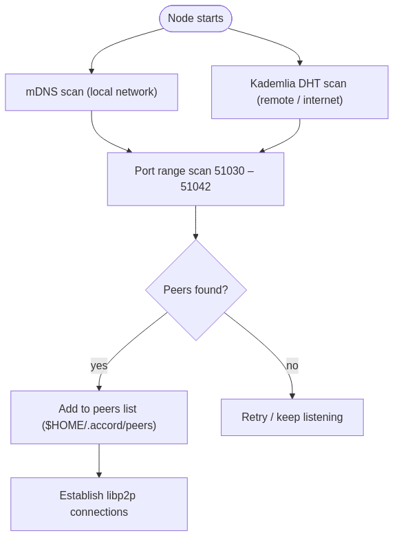 |
| 3 | Full Node Storage Layout | 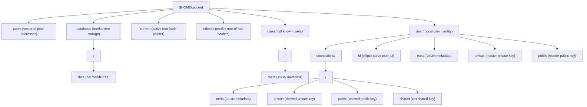 |
| 4 | Cryptographic Key Hierarchy | 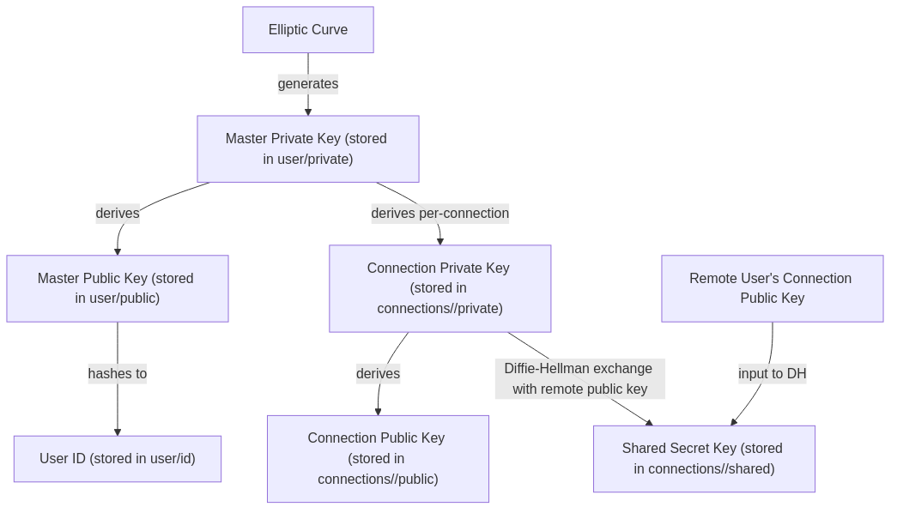 |
| 5a | Sync — Outbound (Node Initiates) | 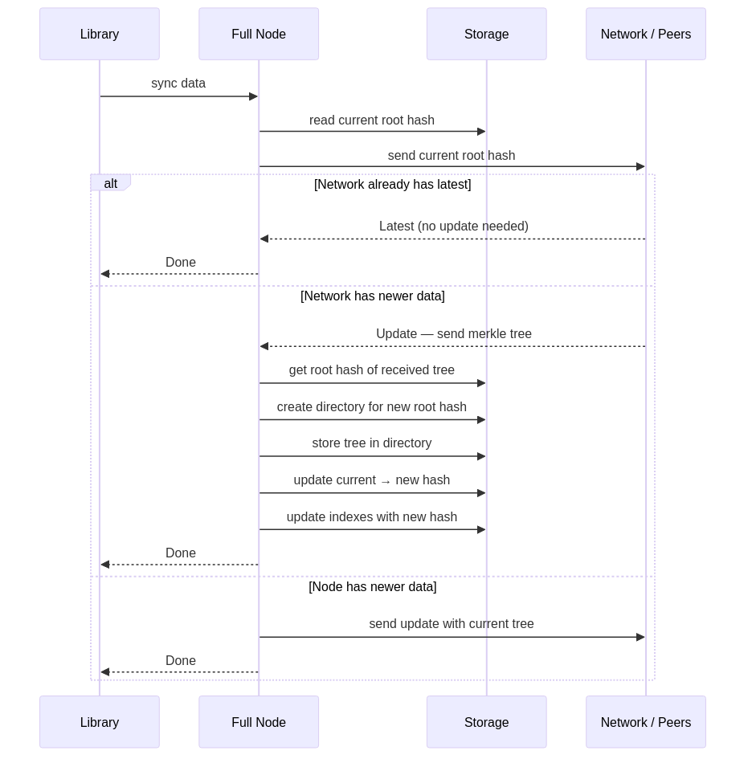 |
| 5b | Sync — Inbound (Peer Initiates) | 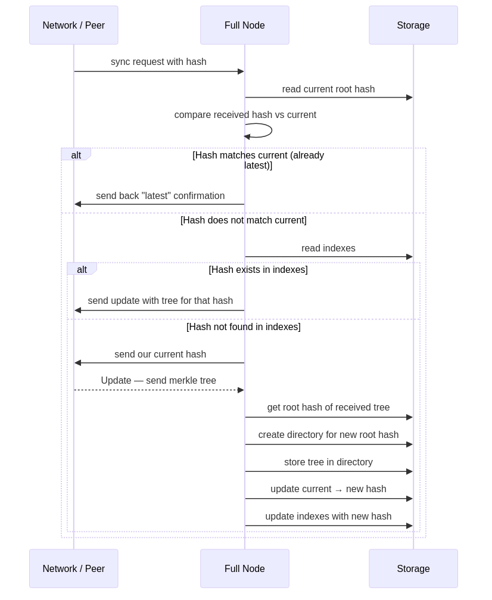 |
| 6 | Message Workflow | 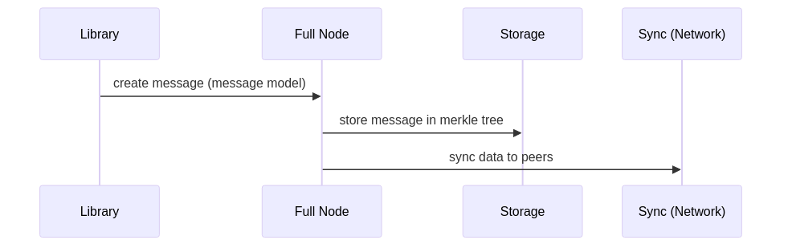 |
| 7a | User Workflow — Create | 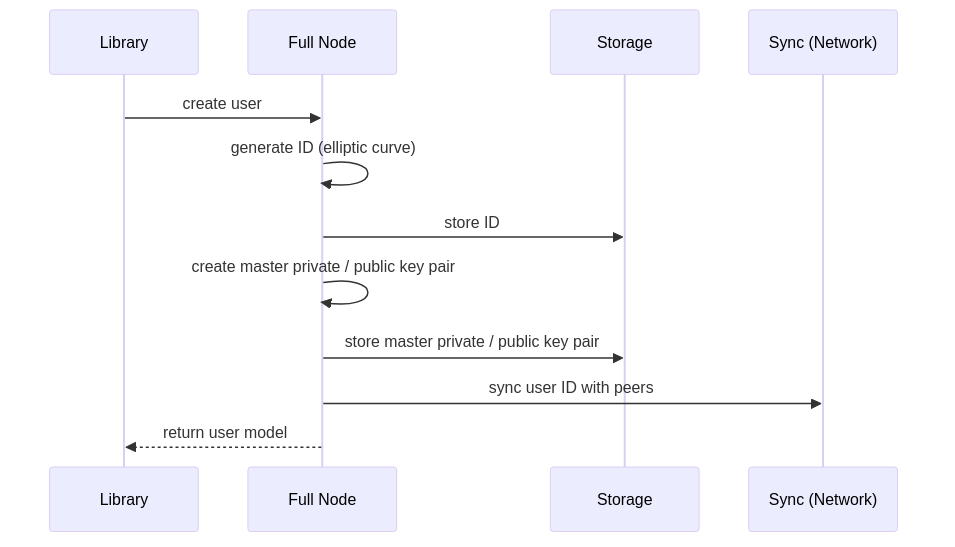 |
| 7b | User Workflow — Get All | 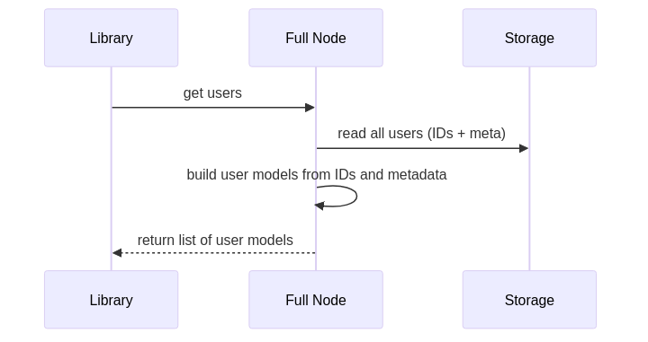 |
| 7c | User Workflow — Get One | 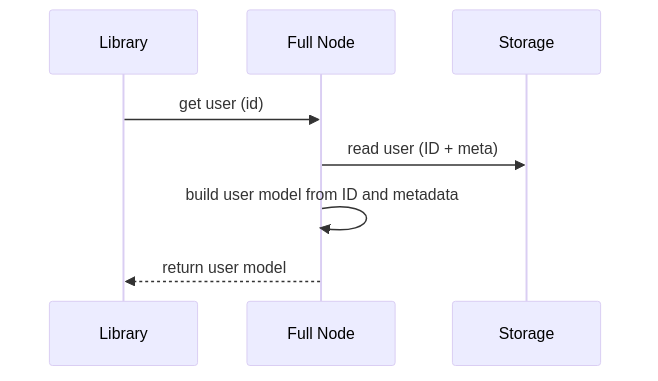 |
| 8 | Connection Workflow (DH Key Exchange) | 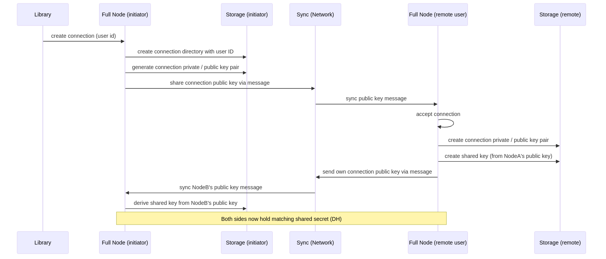 |

---

## Library

The library wraps the node and provides:

- **Typed models** — `Message`, `User`, `Connection`
- **Encryption** — public/private key message encryption and user authentication
- **Plugin system** — plugins are matched by `plugin_type` on incoming messages and executed with the message as an argument

### Models

#### Message

| Field | Type |
|---|---|
| `id` | UUID |
| `from_id` | User ID |
| `to_id` | User ID |
| `plugin_type` | string |
| `plugin_body` | arbitrary |
| `created_at` | timestamp with timezone |
| `updated_at` | timestamp with timezone |
| `deleted_at` | timestamp with timezone |

#### User

| Field | Description |
|---|---|
| `id` | Elliptic curve derived ID |
| `meta` | JSON metadata |
| `private` | Master private key |
| `public` | Master public key |
| `messages` | Associated messages |
| `connections` | Associated connections |

#### Connection

| Field | Description |
|---|---|
| `from_id` | Initiating user ID |
| `to_id` | Remote user ID |
| `private` | Per-connection private key |
| `public` | Per-connection public key |
| `shared` | DH-derived shared secret |
| `meta` | JSON metadata |
